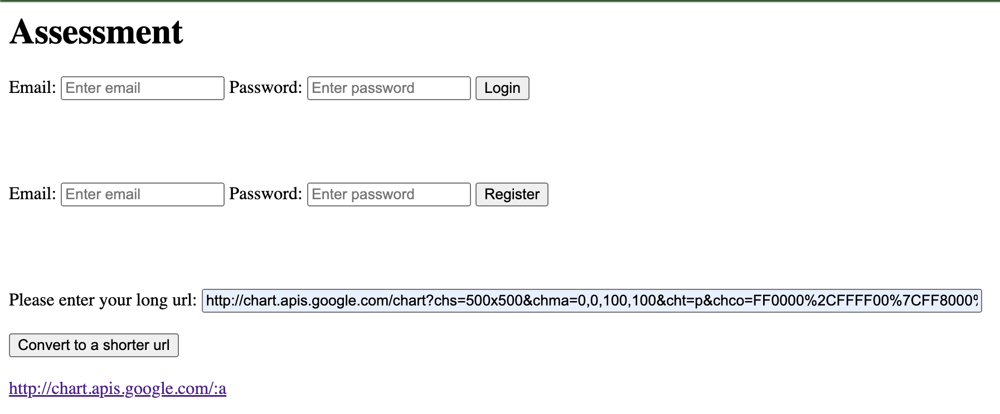

## Shorturl User Stories
- [ ] As a customer I want to be able to submit a link and receive a shortened url back
- [ ] As a user I want to be redirected to the original url after entering the shortened url
- [ ] As a customer I want to be able to create an account using my e-mail address and a password
- [ ] As a customer I want to be able to login to the system
- [ ] As a customer I want to see all shortened urls I create while logged in
- [ ] As a customer I want to be able to delete urls

## Bonus stories
- [ ] As a customer I want to see the raw number of times the url is requested
- [ ] As a customer I want to see the unique number (on IP basis) of times the url is requested
- [ ] As a customer I want, for evil purposes, to be able to enter an account wide url where 10% of all requests are redirected
- [ ] As a customer I want to be able to specify a custom shortened url (with availability check)

